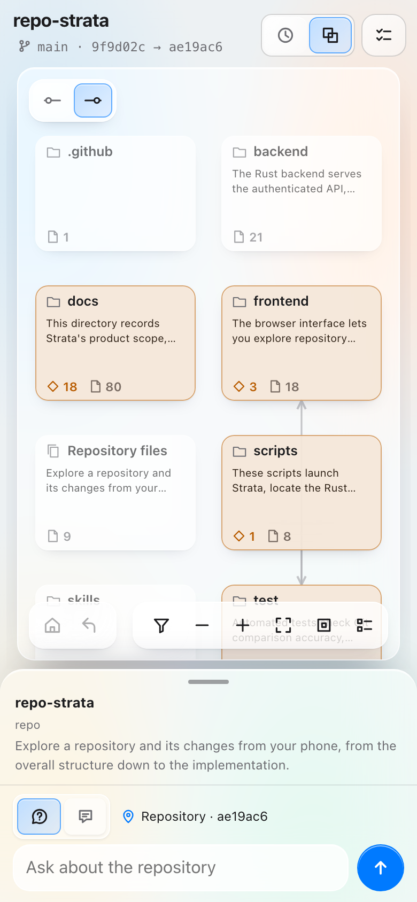
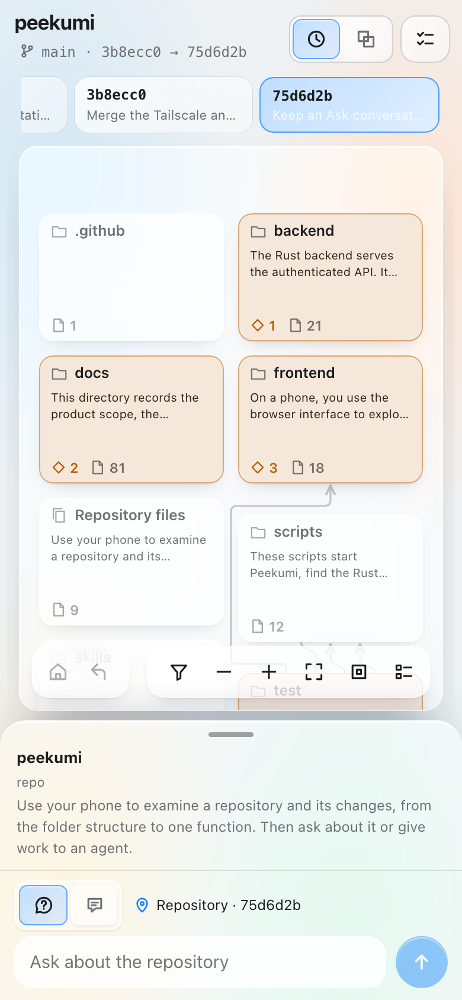
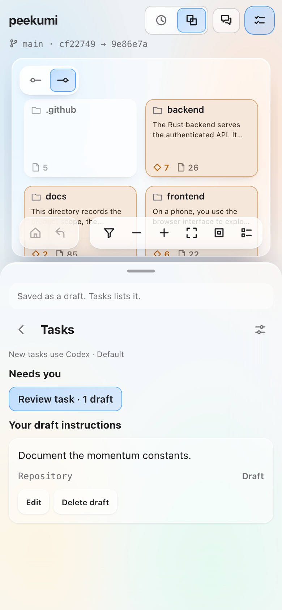
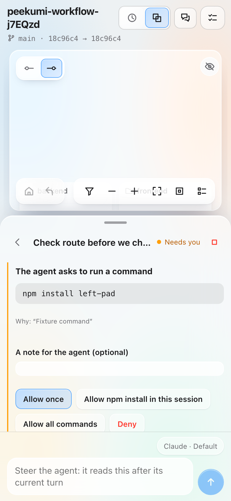

<p align="center"></p>

# Peekumi

Use your phone to examine a repository and its changes, from the folder structure to one function. Then ask about it or give work to an agent.

Peekumi makes a map of the real folders, files and declarations in your repository. It colours the changes between two commits and shows the code and its static relationships. **Ask** uses Claude Code to answer questions about the selection. **Instructions** become tasks that Codex or Claude Code does in a separate worktree, and then you review the result. A **Session** is a live conversation with an agent in its own worktree: you see each step, and the map shows where the agent looks. Peekumi reads only committed code. It changes your checkout only when you tap **Merge** and confirm.

| Repository map | Time travel | Tasks | Sessions |
| --- | --- | --- | --- |
| [](docs/screenshots/mobile-map.png) | [](docs/screenshots/mobile-history.png) | [](docs/screenshots/mobile-tasks.png) | [](docs/screenshots/mobile-session.png) |

## Install

```sh
curl -fsSL https://raw.githubusercontent.com/tee-jagz/peekumi/main/install.sh | sh
peekumi repo add /path/to/repo
peekumi start
peekumi share   # private HTTPS for your phone over Tailscale
peekumi pair    # prints the link to open on your phone
```

Prebuilt releases are available for macOS and Linux (glibc 2.34+). Git is the only necessary software. The script downloads the [latest release](https://github.com/tee-jagz/peekumi/releases/latest) and checks its SHA-256 checksum. To read [install.sh](install.sh) first, or to download and check the archive yourself, see [install without the script](docs/SETUP.md#install-without-the-script). For more details, phone pairing and how to build from source, see [setup](docs/SETUP.md). You can also give your agent the [setup skill](skills/peekumi-setup/SKILL.md).

## Learn more

- [User guide](docs/USER-GUIDE.md): all controls, views and icons, with screenshots.
- [Ask, instructions and agent runs](docs/WORKFLOW.md).
- [Relationships and dependency rules](docs/RELATIONSHIPS.md), with `.peekumi.json`.
- [Development](docs/DEVELOPMENT.md): how to build and test, benchmarks and analysis limits.
- [Architecture](docs/ARCHITECTURE.md), [scope](docs/MVP.md), [validation](docs/VALIDATION.md) and [brand](docs/brand/README.md).
- [Security](SECURITY.md): how to report a problem, and what Peekumi protects. [Changelog](CHANGELOG.md).
- [Contributing](CONTRIBUTING.md): how to propose and make a change, and how to [add a language or an agent provider](docs/EXTENDING.md).

The name of Peekumi was Repo Strata until October 2026. The `strata` command and its settings continue to operate ([details](docs/SETUP.md#renamed-from-strata)).

## License

Peekumi is licensed under the [Apache License 2.0](LICENSE). Copyright 2026 Tolulope Jegede. See [NOTICE](NOTICE).
