# Using Peekumi

This guide shows each part of the Peekumi interface on a phone, and then the desktop layout. Each screenshot has numbered orange markers. The table below each screenshot tells what each numbered element is and how to use it. The screenshots show Peekumi when it inspects its own repository.

For the procedures to install Peekumi, pair a phone and keep Peekumi up to date, refer to [SETUP.md](SETUP.md). [WORKFLOW.md](WORKFLOW.md) gives more information about instructions, agent runs and verification.

The command `node scripts/guide-screenshots.mjs` makes the screenshots and icon images from the live interface. Thus, you can make them again each time the interface changes.

## Contents

- [The map at a glance](#the-map-at-a-glance)
- [Gestures and keys](#gestures-and-keys)
- [Map key](#map-key)
- [Choosing what to compare](#choosing-what-to-compare)
- [Moving through history](#moving-through-history)
- [Selecting something](#selecting-something)
- [The review sheet](#the-review-sheet): Details, Source, Changes, Relations
- [Pages and the way back](#pages-and-the-way-back)
- [Ask, instructions and tasks](#ask-instructions-and-tasks)
- [Conversations](#conversations)
- [Sessions](#sessions) and [agent focus](#agent-focus)
- [The context menu](#the-context-menu)
- [The back button](#the-back-button)
- [Typing on a phone](#typing-on-a-phone)
- [Desktop layout](#desktop-layout)
- [Icon reference](#icon-reference)
- [Notifications](#notifications)
- [Offline and updates](#offline-and-updates)

## The map at a glance

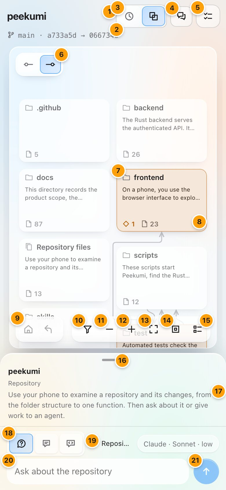

The screen has three parts. The header shows the name of the repository and the comparison. The map in the glass card shows the real folders, files and declarations of the repository. The review sheet at the bottom tells you about the item that you look at. The review sheet also contains the dock, where you ask, write instructions and start sessions.

| # | Element | How to use it |
|---|---|---|
| 1 | Repository name | The repository that Peekumi inspects. If you register more than one repository, use the comparison popover (2) to change between them. |
| 2 | Comparison line | Shows the branch and the two commits that Peekumi compares, as `base → head`. Tap it to change the branch, head, base or pull request. |
| 3 | Time / Diff | **Time** shows commit cards. Use them to go through the history one commit at a time. **Diff** compares any head with any base that you select. |
| 4 | Conversations | Your Ask conversation and your open sessions. Refer to [Conversations](#conversations). |
| 5 | Tasks | Your draft instructions and agent tasks: work to send, review and merge. The icon becomes blue when an agent completes work that is ready for review. |
| 6 | Before / After | Shows in Diff. It changes the map and the source between the base (dot on the left) and the head (dot on the right). |
| 7 | Card | A folder, file or declaration. Tap it one time to select it. Tap it again to open it. The tint shows its change: orange is modified, green is added, red and dashed is removed, and plain is unchanged. A modified declaration also shows which parts changed: signature, documentation or implementation. |
| 8 | Card counts | The number of files in the card that are added, modified or removed, and then the total number of files. |
| 9 | Home and Up | Home goes back to the repository root. Up goes to the parent folder. At the root, the two buttons are dim. |
| 10 | Changes only | Hides unchanged cards at all levels. Changed folders stay on the map, so you can still go down into them. |
| 11 | Zoom out | Zooms the map out. You can also pinch the map. |
| 12 | Zoom in | Zooms the map in. |
| 13 | Fit | Makes the full map fit on the screen. |
| 14 | Reset | Goes back to actual size, with the map aligned to the top. |
| 15 | Key | Opens the map key. The map key also contains the colour lens. Refer to [Map key](#map-key). |
| 16 | Sheet handle | Drag it up or down, or tap it, to move the sheet between peek, half and full height. |
| 17 | Summary | The description of the selection or the current folder. This text comes from committed documentation. You can scroll long text. While more text is available, its last line fades. |
| 18 | Ask / Instruction / Session | Ask a question about the selection, write an instruction for an agent, or start a [session](#sessions) with an agent. |
| 19 | Anchor | The subject of your question or instruction, and the commit that it refers to. |
| 20 | Text field | Type your question or instruction here. |
| 21 | Send | Sends the question. In Instruction mode, Cancel and Save draft replace this button. |

The lines between cards are static dependencies: imports, calls, implementations and inheritance that Peekumi finds in the code. They do not show runtime behaviour. Tap a line to select it. Cards with a dashed outline are neighbours outside the current folder.

When you select a card, Peekumi highlights the connections of that card and fades all unrelated items. Blue lines show what the selection uses. Teal lines show what uses the selection. If the selection has no connections, no items fade. A folder with many lines shows its unchanged lines faintly. Select a card to read its lines.

A long name takes a second line on its card. Inside a file, a method card does not repeat the name of its class when the class has a card on the same level. The full name is in the sheet.

## Gestures and keys

| Action | On a phone | With a mouse or keyboard |
|---|---|---|
| Select a card | Tap | Click, or Tab to it and push Enter |
| Open a card | Tap it again | Click again, or push Enter again |
| Pan the map | Drag. After a flick, the map continues to move | Drag, scroll, or use the arrow keys when the map has the focus |
| Zoom | Pinch | Control or Command and scroll, or `+` and `-` |
| Go up a level | Up button | Up button, or Escape when no item is selected |
| Clear a selection | Tap an empty area of the map, or × in the sheet | Click an empty area of the map, or Escape |
| Close a popover | Tap outside it, or ✕ | Escape |
| Change sheet height | Drag or tap the handle | Arrow keys, Home and End on the handle |
| Open the context menu | Hold a card or a name for half a second | Right-click, or Shift+F10 on a focused card |
| Go back one step | The back button or back gesture of the phone | The back button of the browser |

## Map key

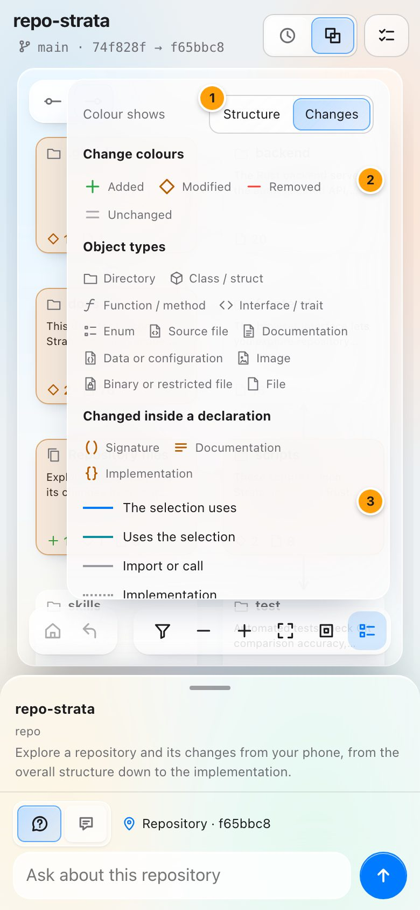

| # | Element | How to use it |
|---|---|---|
| 1 | Colour lens | **Changes** colours the cards by Git status. **Structure** hides the change colours and shows the plain layout. |
| 2 | Colours and types | The meaning of each change colour and shape. The icon for each type of folder, declaration and file. The icons for the parts that changed in a declaration. |
| 3 | Line styles | Blue lines show what a selection uses. Teal lines show what uses the selection. Solid lines are imports or calls, dotted lines are implementations, and dashed lines are inheritance. Red shows a removed relationship or a broken dependency rule. |

## Choosing what to compare

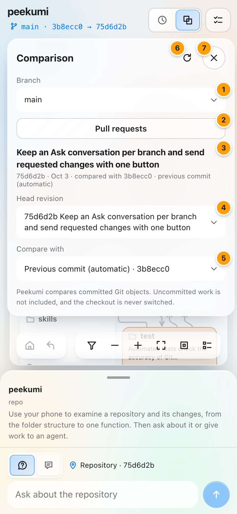

Tap the comparison line in the header to open this popover.

| # | Element | How to use it |
|---|---|---|
| 1 | Branch or Pull request | Select which list to use. **Pull request** shows the pull requests of the repository instead of the branch controls. |
| 2 | Branch | Select the branch to inspect. The most recent branches are first. The list does not show a remote branch that has a local copy, or the branches of agent tasks (the Tasks view shows them). Type in the filter box at the top of a long list to find a branch. This changes only what you see. Peekumi never switches your checkout. |
| 3 | Commit summary | The message and date of the head commit, and the commit that Peekumi compares it with. |
| 4 | Head revision | The newer commit in the comparison. |
| 5 | Compare with | The older commit. **Previous commit (automatic)** follows the first parent of the head. If you select a specific commit, Peekumi pins it until you select the automatic option again or tap **Use previous commit**. |
| 6 | Refresh | Looks for new commits. Peekumi never shows uncommitted work. |
| 7 | Close | Closes the popover. You can also tap anywhere outside the popover to close it. |

A list with more than 12 entries opens at the current entry. It has a filter box at the top and shows the number of entries at the bottom.

### Viewing a pull request

Tap **Pull request** in the comparison popover. The popover shows the open pull requests, then up to 10 recently merged pull requests. Each row shows the number, title, state, author and date. You see this list only when GitHub CLI is signed in on the host.

When you tap a pull request, the map shows all of its changes, from its merge base to its head. The header shows `PR #3 · base → head`. Tap **✕** next to it to go back to your branch.

When nothing is selected, the sheet shows the pull request:

- At the lowest sheet height, the sheet shows the state (Open, Draft, Merged or Closed), the branches, the title, the author, the date and the size.
- When you pull up the sheet, it also shows the first paragraph of the description, **Read full description**, one line for checks, one line for reviews and **Open on GitHub**. Tap **Checks** or **Reviews** to see the full list.

Select a card to see its details. To see the pull request again, tap an empty area of the map and go back to the top of the map. Ask uses the two commits of the pull request. Peekumi does not send comments or reviews to GitHub.

When you register more than one repository, a **Repository** picker shows above Branch.

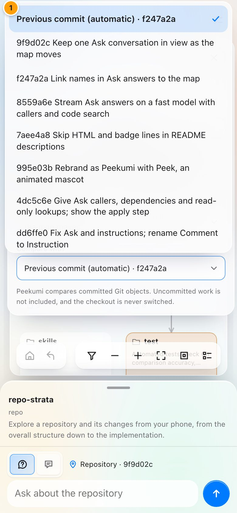

Each picker opens a menu like this one. A check mark (1) shows the current choice. Tap an option to select it. You can also use the arrow keys, Home, End and Enter. Escape closes the menu and makes no changes.

## Moving through history

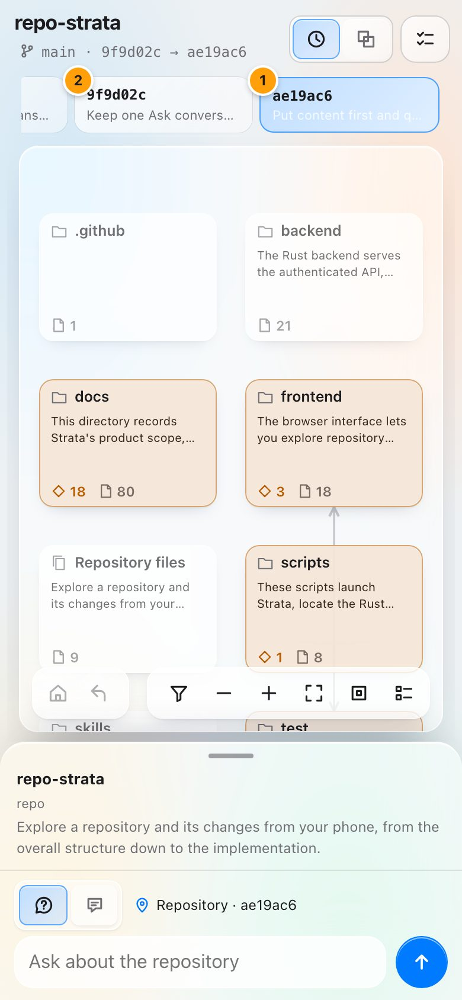

In **Time**, a strip of commit cards shows above the map. The highlighted card (1) is the commit that Peekumi shows, compared with its parent. Tap a different card (2) to go to that commit. Swipe the strip to the side to see older commits. Peekumi loads 80 commits at a time. When older commits exist, the first card is **Earlier**: tap it to load the next 80. In **Diff**, the last item of each commit list is **Earlier commits…**.

### Uncommitted changes

When the checked-out branch has changes that you did not commit, the map of the newest commit includes them. It shows the code as it is on your disk now. A file or folder with uncommitted changes has a dashed outline. The newest commit card says how many files, for example **+ 4 uncommitted**. Older commits show without them. Ignored files stay out. Peekumi does not change your files or your Git index.

Peekumi reads the changes when it loads the branch. Tap **Refresh** to read them again. When you come back to the app, Peekumi also reads them again. An instruction on uncommitted code is kept, but an agent starts from the last commit, so it does not have your uncommitted changes. Commit them first if the agent must use them.

## Selecting something

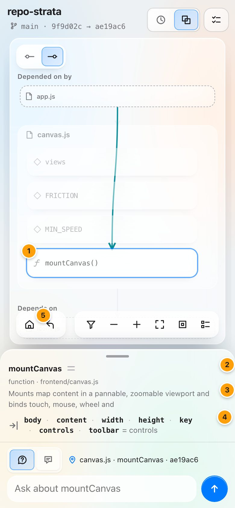

| # | Element | How to use it |
|---|---|---|
| 1 | Selected card | A blue outline shows the selection. Tap it again to open it. A folder or file opens on the map, and a declaration opens in Source. |
| 2 | Name and status | The name of the selection, its change status icon, and its type. For a modified declaration, a line such as **Signature and implementation changed** tells which parts to inspect. |
| 3 | Summary | Its committed documentation. Scroll it to read more. |
| 4 | Inputs, outputs and fields | One line each for the parameters, the return type and the class fields. Swipe to the side to see all of them. A fade on the right shows that there is more. Only declared types show here. The Details view puts a label on each missing annotation. |
| 5 | Up | Closes the file and goes back to its folder. |

## The review sheet

Drag the sheet up to half or full height to inspect the selection. The view buttons stay at the top of the sheet. If you move the sheet up, a different view never moves it down.

### Details

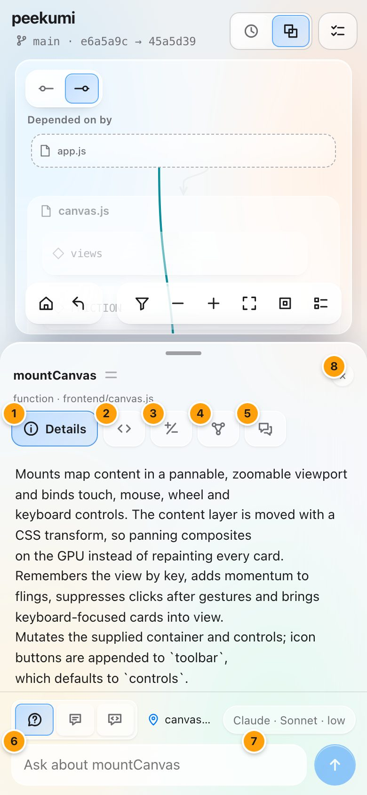

| # | Element | How to use it |
|---|---|---|
| 1 | Details | Facts, documentation and declaration metadata for the selection. |
| 2 | Source | The code, as a diff or as the Before or After version. |
| 3 | Changes | Changed files or declarations in the current scope, and file search. |
| 4 | Relations | Dependencies, dependency rules and their evidence. |
| 5 | Facts | One quiet line after the content: the line range, or the file and change counts for a folder. |
| 6 | Main action | The next step for this selection, such as **View source**, **Open file**, **Open folder** or **Show evidence**. It is next to the facts. |
| 7 | Clear selection | Removes the selection and sets the sheet back to the current folder or file. |

Expanded Details is the peek view in full. It shows the full description and the same **In** and **Out** lines, with parameter defaults. It also shows notes on parameters where the code documents them. For a folder, it shows the README or package docstring of the folder as plain text, with a link to the full file. At the end, a small **adapter** note gives the name of the language adapter that read the file. Tap the note to see what the adapter extracts and its limits.

Only the open view button has a label. The other view buttons show only their icons. The [icon reference](#icon-reference) lists all of them.

### Source

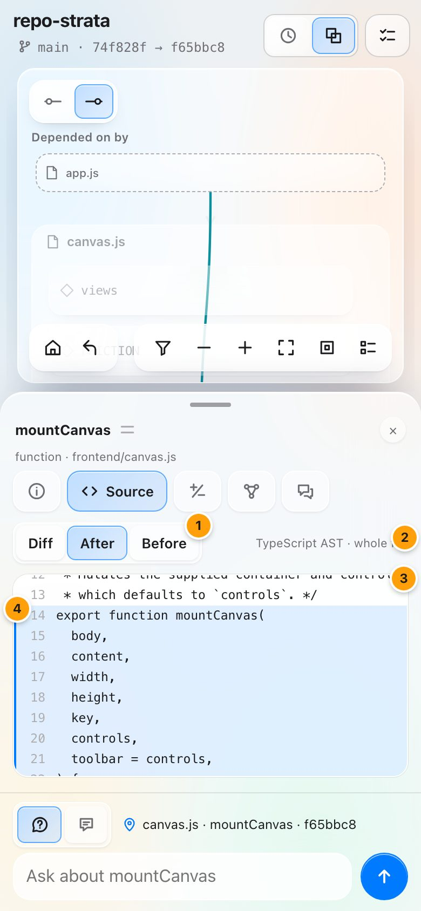

| # | Element | How to use it |
|---|---|---|
| 1 | Diff / After / Before | **Diff** shows the changes with old and new line numbers. **After** and **Before** show the full file at the head or base. |
| 2 | Code | Scrolls in its own box. This box fills the sheet, so the controls above it stay in position. When you select a declaration, **Diff** shows only the changes to that declaration. |
| 3 | Highlight | Peekumi highlights the lines of the selected declaration and scrolls them into view. |

### Changes

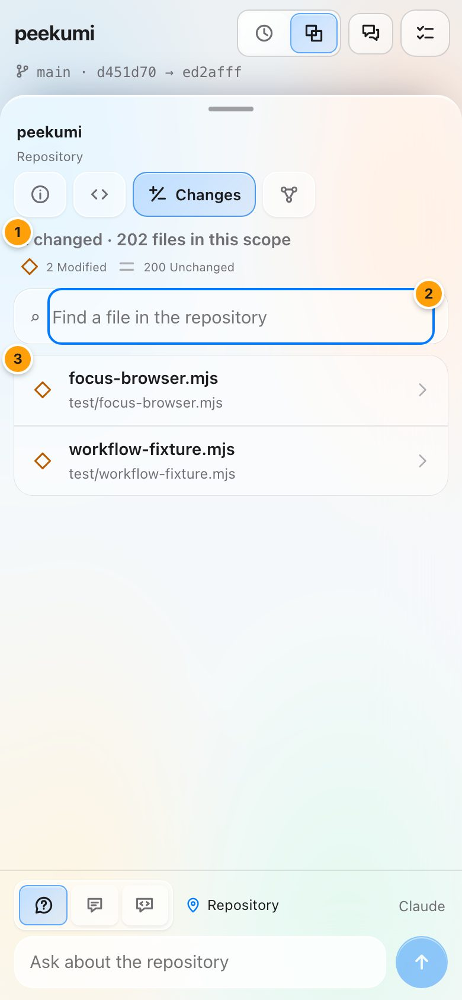

| # | Element | How to use it |
|---|---|---|
| 1 | Overview | The number of files that changed in the current scope, with counts for each change type. |
| 2 | Search | Finds any file in the repository by its path, changed or unchanged. |
| 3 | Changed file | Tap to open the file on the map. In a file, the list shows changed declarations, not files. |

### Relations

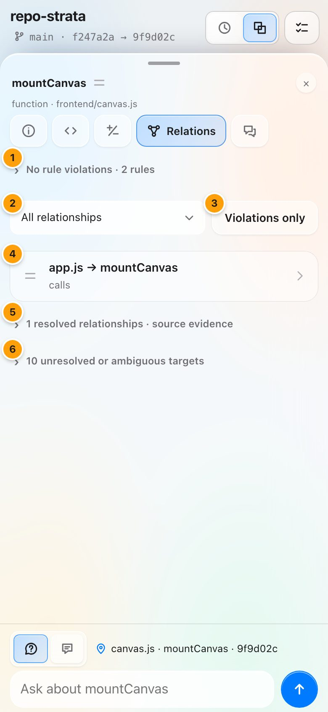

| # | Element | How to use it |
|---|---|---|
| 1 | Rule summary | Results of the dependency rules committed in `.peekumi.json`. The first part counts the breaks that this comparison adds. Expand it to see warnings about rules that check nothing, the added breaks, and for each rule what it checked, what broke it and what stayed unresolved. If there is no rules file, it says that rules are not configured. |
| 2 | Relationship kind | Show all relationships, or only imports, calls, implementations or inheritance. |
| 3 | Violations only | Show only relationships that break a dependency rule. |
| 4 | Relationship | `from → to`, with its kind, its change status, and the number of sites before and after. Tap it to select it and to see a button for each file that it involves. |
| 5 | Resolved evidence | Each relationship that Peekumi found in the code, with a link that opens the exact source line. |
| 6 | Unresolved targets | References that Peekumi cannot resolve with certainty, and the reason. Peekumi lists these references and does not guess. |

A card that starts a dependency rule break shows a red broken-link icon and the number of breaks. When you select it, one red line under its kind says which rule it breaks, for example **Breaks backend-layers · 6 calls to main.rs**. Tap the line to see only the breaks in Relations. There, **Propose fixes** asks your Ask agent to read the code and propose fixes. Select, edit or clear the fixes, then send them together to an agent as one task.

When you select a relationship, **Forbid this dependency** starts an instruction that asks for a rule against it. Edit the text, then save the draft. A task that adds rule breaks names them before **Approve**.

## Pages and the way back

The sheet shows the map's own views (Details, Source, Changes and Relations), or a page: Conversations, Ask, a session, Tasks, a task, History, or the instructions on a selection. A page opens over the view that you looked at, and it takes the whole sheet.

Each page has one header row: a back arrow, its title and its few actions. The arrow, the phone's back button and Escape all do the same thing: they go back to the view before. From another aspect of the map, Back returns to Details. When nothing is open, Back clears the selection, then goes up one level of the map, and then leaves Peekumi.

When you select a card from a list or a task, the map opens over it, and Back returns to the list or the task. A tap on an empty part of the map closes a list or a task. In Ask or a session, the conversation stays on the screen when you select a card: the card becomes the subject of your next message.

The dock follows the page. On the map it has three modes: Ask, Instruction and Session. In a conversation it is that conversation's box. On a task that can take changes, it is the box for those changes. A list has no dock.

## Ask, instructions and tasks

**Ask** uses Claude Code on this computer to answer questions about the selection. It reads only committed code. It cannot run, change or send anything. For a file or declaration, it reads the source and its diff. It also reads what the code calls, imports or inherits, and what calls the code. For a folder or the whole repository, it reads the README of that folder, the declarations in it and the diffs of its changed files.

When that is not sufficient, Ask can look up more of the repository at the same revisions. It can search declarations or the code, read a declaration or file, and follow relationships. It can do up to 30 lookups for each answer. Before it answers, Ask checks each fact that the answer depends on. If a first draft leaves a fact unchecked, Ask checks it and writes the answer again. The answer shows while Ask writes it. Ask shows each lookup while it occurs, and lists what it looked up.

Some names of files and declarations in an answer point to exactly one location. These names have a dotted underline. Tap one, and the map moves to that location and selects it. Your question shows immediately when you send it. You can type the next question while the answer loads. Answers are in ASD-STE100 Simplified Technical English: short sentences, one meaning for each word, and steps as numbered instructions.

If the answer ends with a suggested instruction, **Save as draft instruction** keeps it as a draft for the same selection. When you explore the changes of a task, this button shows **Add to requested changes**. The save button of the Instruction box also shows this label. Each of these buttons adds the change, at the location that it is about, to the next round of that task. Then you can continue to explore. Peekumi does this because a new draft starts from main and does not contain the work of the agent.

### Agents

Tap the agent name next to the composer, for example **Claude · Sonnet · low**. It shows what the current mode uses, and it opens that list. On a phone it shows only the agent, for example **Claude**. The **Agents** icon (two sliders) in the header of the Tasks page opens both: **Ask** sets what answers your questions, and **Tasks** sets what changes your code. For each one:

1. Select the provider. For Ask: Claude Code, or OpenRouter (any model, with your API key). For tasks: Claude Code, Codex or OpenRouter. With OpenRouter, Peekumi runs the model itself: it reads, searches, edits and commits files in the worktree of the task, but it cannot run commands or tests. The first time that you select OpenRouter, paste your API key and tap **Test and save**.
2. Select a model. **Default** is the model that the provider uses on its own. The other models come from the provider. **Other model** lets you type the name of a model.
3. Select the effort. **Auto** lets the provider decide. The other levels are the ones that the selected model supports. Higher effort works more carefully, but slower.

A provider that is not ready is grey and shows the reason. The choice stays on this device, for this repository. A task keeps the agent, model and effort that it started with, in all its rounds.

The **Back to task** chip shows the number of changes that wait ("2 to send"). The task lists those changes, and you can edit them. The button below the list sends them together, for example **Send 2 changes to Codex**.

When you send a question, the Ask page opens, and its dock is the question box. To open it again later, use [Conversations](#conversations). One conversation continues for the branch. It stays on the screen while you move on the map. Each question is about the item that is selected when you send it. "About …" shows where the subject changes. Each branch has its own conversation. When you explore the branch of an agent, Ask shows the conversation for that branch. When you go back, Ask shows the conversation for your branch again. Peekumi keeps each conversation, so a reload or an app update does not remove it. The **+** in the header of the Ask page starts a new conversation for the branch that you see.

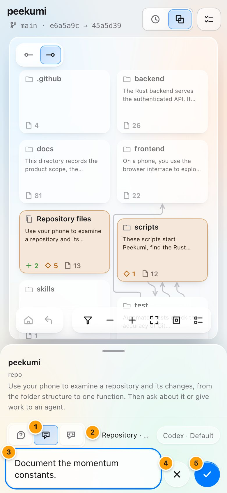

| # | Element | How to use it |
|---|---|---|
| 1 | Instruction | Changes the box from a question to an instruction for an agent. |
| 2 | Anchor | The selection and commit that the instruction is attached to. It stays attached if you go to a different location before you save. |
| 3 | Instruction text | Describe the change that you want and the reason for it. |
| 4 | Cancel | Discards the unsent instruction. |
| 5 | Save draft | Saves the instruction as a draft. The map stays. Details then shows "1 instruction here", which opens the instructions on that selection, and Tasks lists the draft. Drafts are private until you send them to an agent. |

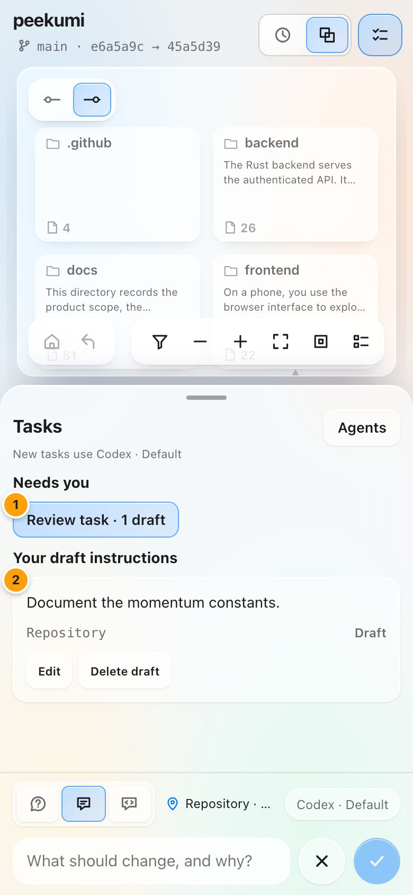

| # | Element | How to use it |
|---|---|---|
| 1 | Review task | Makes a task from your drafts. Select the drafts and optional extra instructions. The task uses your choice for tasks in **Agents**; **Change** opens it. Then look at a preview of the exact task before you start it. |
| 2 | Draft | A saved instruction with its anchor and commit. You can edit or delete it while it is a draft. |
| 3 | Back | Goes back to the view before. The phone's back button does the same. |

After a task starts, the same view shows the progress of the agent, the checks that the agent reports and the commits that it made. The task first shows its state, then each instruction and the result from the agent. **Explore changes** shows all the work of the agent on the map, compared with the commit that the task started from. **Back to task** takes you back to the task and your previous view. **Agent log** contains the messages of the agent, the raw events and the generated task.

**Approve** records your review. To add a note, tap **Add note** first. To ask for changes, write each change in the box at the bottom of the task and tap ✓. Peekumi adds the change to the list of the task. **Request changes** puts the cursor in that box. Then tap the button below the list, for example **Send 1 change to Codex**. The same agent starts the next round. That round starts from the last commit of the agent, so Peekumi keeps the earlier work. To open an earlier round, use **Open round N** in the latest round.

Tasks hold only work. An open session is a conversation, so it is in Conversations; after **Send to review** it becomes a task. The Tasks list puts tasks in groups by what they need from you. **Needs you** has drafts and tasks to review. **Working** has the tasks that an agent works on now. **Done · waiting to merge** has approved tasks that you did not merge yet, and these are muted. When a task is applied to main, it goes to **History**. A link at the bottom of the list opens History. On a selection, approved instructions and instructions of applied tasks go into one line, "N earlier instructions", which opens when you tap it.

The Tasks button opens the Tasks list over the current view. Tap it again, or tap an empty area of the map, to go back. While an agent works, Peek works inside the Tasks button, and a small Peek with **Working** shows at the right of the sheet's title row. Tap it to open the task. When the agent completes its work, Peek jumps one time and the icon becomes blue for review. If Peek droops on an orange tint, a task stopped before it was complete and needs your action.

Approval of a task does not change your code. After you approve, the task shows **Ready to merge into main**, with the number of commits and changed files. Tap **Merge into main**, then **Merge** to confirm. Peekumi does a fast-forward of main to the last commit of the task. It never pushes. After the merge, the task shows **Merged into main** and an **Undo merge** button. Undo works until main changes.

If you have uncommitted changes in a file that the merge changes, the task shows the files that are in the way. Tap **Commit my changes, then merge**. An agent writes a commit message for only those files. Examine the files and the message, then tap **Commit**. If main has new commits, tap **Update with main**. If main and the task conflict, the agent resolves the conflict in a new round, and you review the task again. Refer to [WORKFLOW.md](WORKFLOW.md) for the full loop.

## Sessions

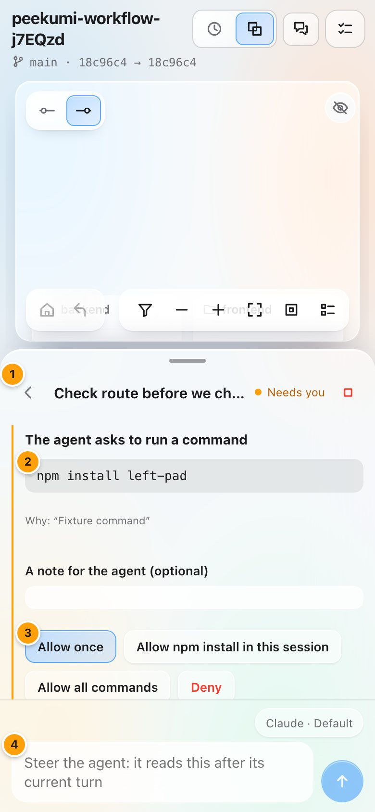

A session is a live conversation with an agent. Use it when you want to work together with the agent, step by step. The agent reads and changes code, runs checks and commits, in its own worktree and on its own branch. You read each step and reply between its turns.

To start a session, select a part of the map and tap **Session** in the dock. Write what you want to work on, and tap **Start session**. The session uses your choice for tasks in **Agents**.

| # | Element | How to use it |
|---|---|---|
| 1 | Header | The title and the state of the session: **Working**, **Your turn** or **Needs you**. While the agent works, the small square stops the turn. The arrow takes you back to the view before. |
| 2 | Command request | Claude Code asks before it runs a command that is not on the session's list. The request shows the command and the reason. |
| 3 | Answer | **Allow once**, **Allow … in this session**, **Allow all commands** or **Deny**. You can add a note for the agent. |
| 4 | Reply | Your next message to the agent. If a part of the map is selected, the message includes it. If you send while the agent works, the message waits for the next turn. |

Each step of the agent shows in the conversation. Tap a step to see its output. A file or declaration name in the conversation is a link: tap it, and the map moves there while the session stays on the screen. Under the conversation, one line gives the agent, the turns, the commits and the cost. Links there show the changes on the map, change how the session treats commands, and end the session.

**Allow all commands** lets the agent run any command with no question. Use it only for work that you trust. With Claude Code, the shield next to **Start session** sets it before you start: amber means that all commands are allowed. Codex and OpenRouter have no shield, because they never ask before commands. Refer to [SECURITY.md](../SECURITY.md#agent-tasks-and-sessions).

To finish, tap **End session**, then **Send to review**. The work then goes through the normal review: **Approve**, then **Merge**. Refer to [WORKFLOW.md](WORKFLOW.md#sessions) for all the details.

### Agent focus

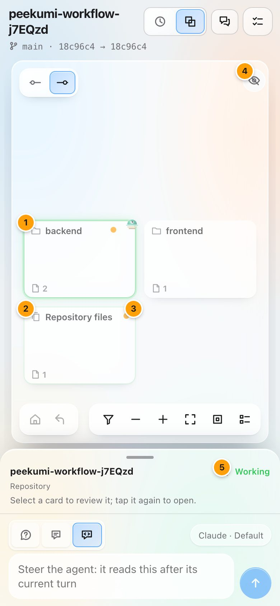

The map shows where the agent looks. This works for a session, for a task while its agent works, and for an Ask answer while it reads the code.

| # | Element | How to use it |
|---|---|---|
| 1 | Now | The card of the agent's current place glows, and a small Peek works on it. When the place is inside a folder, the folder card glows. |
| 2 | Trail | The places before the current one keep an outline that fades with age. |
| 3 | Changed | An amber dot marks a file that the session changed, or a folder that holds one. |
| 4 | Follow | Tap the eye to move the map with the agent. The map puts the agent's place in the middle. When you move the map yourself, Follow pauses. Tap the eye again to continue. |
| 5 | Live line | When the session, or a task at work, is not on the screen, a small Peek and one word show at the right of the sheet's title row: **Working**, **Needs you** or **Your turn**. Tap them to open the session or the task. |

The map key explains the three marks while a session is open.

## Conversations

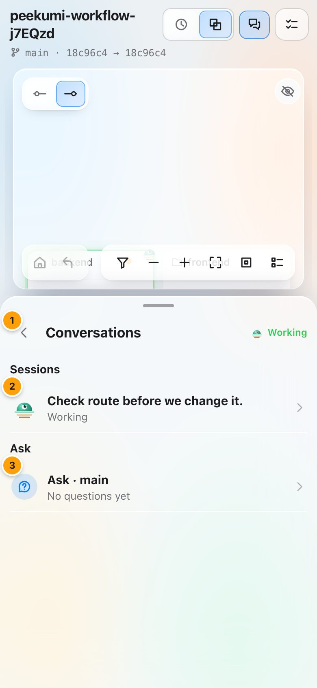

Conversations holds the talks with agents: your open sessions and the Ask conversation of the branch on the map. Open it with the Conversations button in the header.

| # | Element | How to use it |
|---|---|---|
| 1 | Back | Goes back to the view before. |
| 2 | Session | An open session, with its state. Tap it to open the session. |
| 3 | Ask | The Ask conversation of this branch, with your last question. Tap it to read it and ask more. |

## The context menu

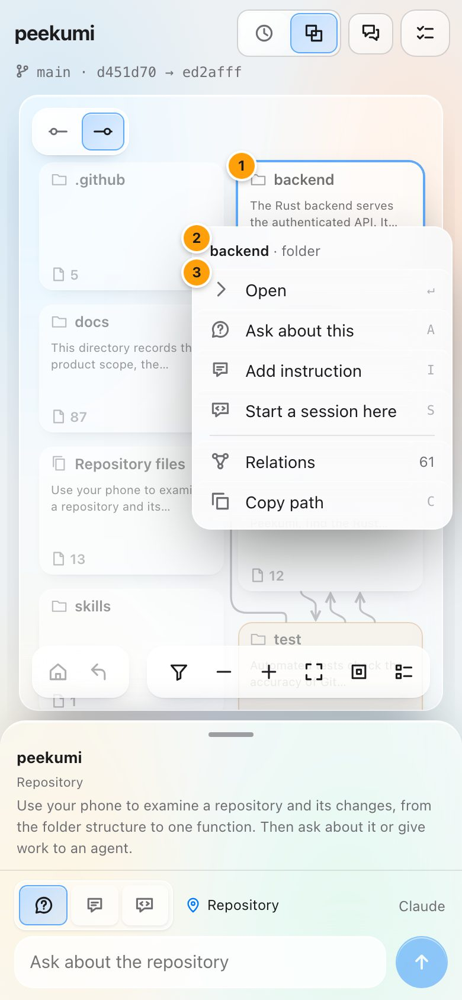

Hold a card or a name for half a second. On a desktop, right-click it. A small menu opens next to it, and the rest of the map dims.

| # | Element | How to use it |
|---|---|---|
| 1 | Item | The card or name that the menu is about. |
| 2 | Header | The name and the kind of the item. |
| 3 | Actions | Only the actions that fit the item: **Open** or **Source**, **Ask about this**, **Add instruction**, **Start a session here** (or **Point the agent here** while a session is open), **Relations**, **Changes** and **Copy path**. For a name in a conversation: **Show on the map** and **Reply about this**. |

On a desktop, the letters at the right run the actions. A finger that moves before the half second pans the map and opens no menu. The menu has no action that deletes or changes anything.

## The back button

The back button of the phone, and the back button of the browser, go back one step inside Peekumi. Each press closes the most recent layer first: a menu or a popover, then a task or a session, then a sheet view such as Ask or Source, then the selection, and then one level of the map. At the top of the map, with nothing open, back leaves Peekumi.

## Typing on a phone

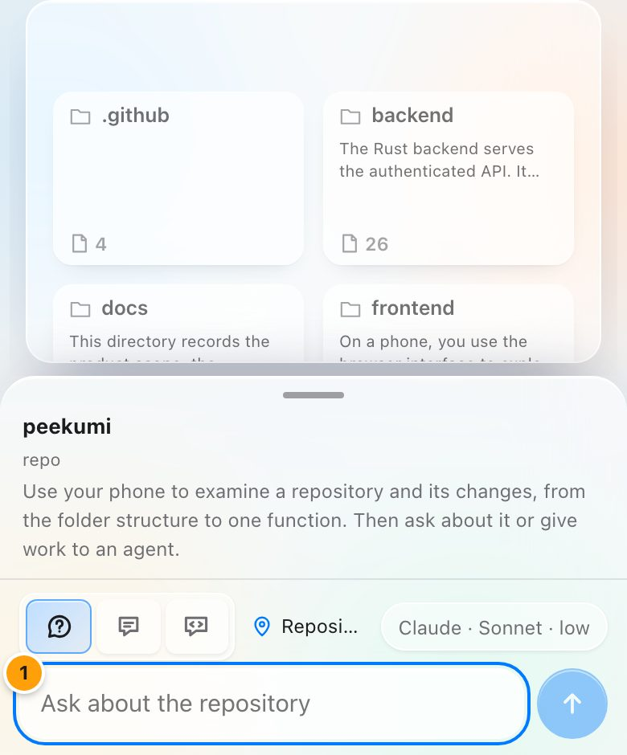

When the keyboard opens, the header and the map controls move away. The sheet keeps its size at peek height, and the text field (1) stays above the keyboard. The map stays on the screen, so you can still see the subject of your question.

## Desktop layout

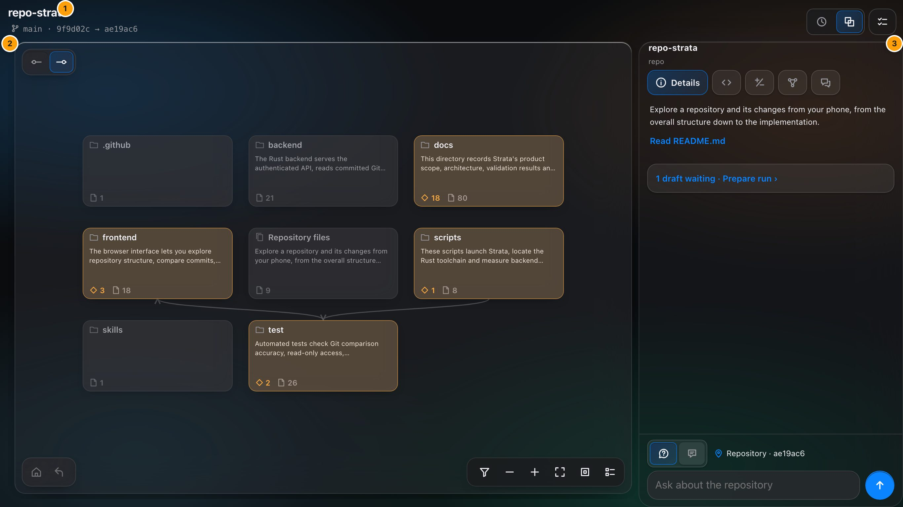

On a wide screen, the header (1) is across the top and the map (2) fills the left side. The review sheet (3) is on the right at full height. A phone on its side uses this layout too. All other functions operate the same way. Peekumi uses the light or dark appearance of the system.

## Icon reference

Each icon button has a name. The name shows as a tooltip, and screen readers read it.

### Header and map

| Icon | Name | What it does |
|---|---|---|
|  | Branch | Marks the comparison line. Tap it to change the branch or the comparison. |
|  | Time | Go through the history with commit cards. |
|  | Diff | Compare any two commits. |
|  | Tasks | Drafts and agent runs. |
|  | Before | Show the base revision. |
|  | After | Show the head revision. |
|  | Home | Go to the repository root. |
|  | Up | Go up one level. |
|  | Changes only | Hide unchanged cards. |
|  | Zoom out | Zoom the map out. |
|  | Zoom in | Zoom the map in. |
|  | Fit | Fit the map on the screen. |
|  | Reset | Actual size. |
|  | Key | Map key and colour lens. |

### Review sheet

| Icon | Name | What it does |
|---|---|---|
|  | Details | Facts and documentation. |
|  | Source | Code and diff. |
|  | Changes | Changed files and search. |
|  | Relations | Dependencies and rules. |
|  | Conversations | Your Ask conversation and your open sessions. |
|  | Ask | Ask a question about the selection. |
|  | Instruction | Write an instruction for an agent. |
|  | Anchor | The subject of the question or instruction. |
|  | Send | Send the question. |
|  | Save draft | Save the instruction. |
|  | Cancel or close | Discard, or close a popover. |
|  | Copy | Copy the command that applies a reviewed task. |
|  | Refresh | Look for new commits. |
|  | Agents | In the Tasks header: choose the provider, model and effort for Ask and for tasks. |

### Change status

Each status has its own shape and its own colour.

| Icon | Status |
|---|---|
|  | Added |
|  | Modified |
|  | Removed |
|  | Unchanged |

### Folders, files and declarations

Icons show what a card is. They never show its change status. Source files are files that a language adapter parsed. Peekumi identifies other files by their extension.

| Icon | Kind | Icon | Kind |
|---|---|---|---|
|  | Folder |  | Source file |
|  | Repository files (root files group) |  | Documentation |
|  | Class or struct |  | Data or configuration |
|  | Function or method |  | Image |
|  | Interface or trait |  | Binary or restricted file (no preview) |
|  | Enum |  | Other file |

### Changed parts of a declaration

A modified declaration shows which parts changed, on its card and in the sheet. Peekumi compares the structure of the code, not its behaviour. Peekumi does not count changes to whitespace only. "Implementation" means that the code in the body changed, not that the behaviour is different. A change outside these parts, for example a Python decorator, shows as plain **Modified**.

| Icon | Part | What changed |
|---|---|---|
|  | Signature | Parameters, return type, generics, base classes, or the declared fields of a struct or class |
|  | Documentation | Doc comments or docstrings |
|  | Implementation | The code of the body, without documentation |

### Inputs and outputs

| Icon | Meaning |
|---|---|
|  | Inputs: parameters |
|  | Outputs: return type or description |
|  | Fields declared on a class |

## Notifications

Peekumi can tell your phone when an agent finishes, also when the app is closed. Open **Tasks**, then tap the bell. Allow notifications when the browser asks. The bell shows a slash when notifications are off. Tap the bell again to turn them off.

You get a notification when a task is ready for review or needs you. You also get one when a session agent asks to run a command or waits for your message. When Peekumi is open on the screen, you see the change in the app and get no notification. Tap a notification to open its task or session.

On an iPhone or iPad, notifications work only in the Home Screen app. In Safari, tap **Share**, then **Add to Home Screen**. Open Peekumi from the Home Screen, and then tap the bell. Notifications need HTTPS, for example `peekumi share` with Tailscale.

## Offline and updates

Peekumi runs on your own computer, and the phone app is a window into it. If the phone loses its connection, the comparison line in the header says **Offline**. Peekumi stores no code on the phone. When the server has a new version, the same line says **Update ready**. Save all unsent text, and then tap **Reload**, or tap **Later**. After a reload, the map opens at the same folder or file, with the same selection. Changes to the name, icon or full-screen mode of the app occur after you remove the app from the home screen and add it again.
